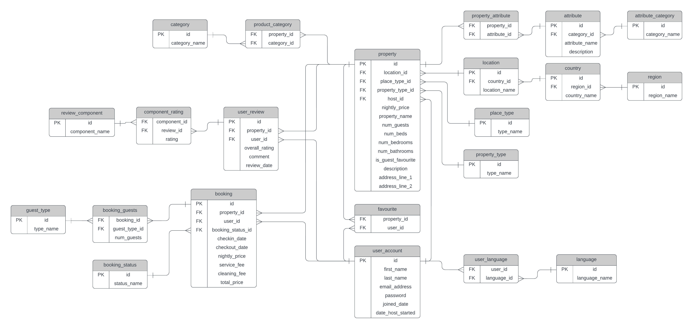

# 🧑‍💻 DB5785 - PostgreSQL and Docker Workshop 🗄️🐋

This workshop will guide you through setting up and managing a _PostgreSQL database_ using Docker.  
You will also explore how to use _pgAdmin_ GUI to interact with the database and perform various tasks.  

You will have to add to the [Workshop Files & Scripts](#workshop-id) section your own specific implementation  
- see: *[Markdown Guide](https://www.markdownguide.org)* and *[Writing and Formatting in Github](https://docs.github.com/en/get-started/writing-on-github/getting-started-with-writing-and-formatting-on-github)* for modifying this Readme.md file accordingly. 

---

## Prerequisites

Before you begin, ensure you have the following installed on your system:

- **Docker**: [Install Docker](https://docs.docker.com/get-docker/)

---

### option 1:  [Setting Up: PostgreSQL, pgAdmin, and Python with Docker-Compose](DockerComposeSetup_for_PostgreSQL_pgAdmin_and_Python.md)

---
### option 2:  [Setting Up PostgreSQL and pgAdmin within Docker (whithout Docker-Compose)](DockerSetup_for_PostgreSQL_and_pgAdmin_using_shell.md) 
---

## Workshop Outcomes

By the end of this workshop, you will:

- Understand how to set up PostgreSQL and pgAdmin using Docker.
- Learn how to use Docker volumes to persist database data.
- Gain hands-on experience with basic and advanced database operations.

----

<a name="workshop-id"></a>
## 📝 Workshop Files & Scripts (to be modified by the students) 🧑‍🎓 

This workshop introduces key database concepts and provides hands-on practice in a controlled, containerized environment using PostgreSQL within Docker.

### Key Concepts Covered:

1. **Entity-Relationship Diagram (ERD)**:
   - Designed an ERD to model relationships and entities for the database structure.
   - Focused on normalizing the database and ensuring scalability.

   **[Add ERD Snapshot Here]**
   
 images/erd/addimagetoreadme.PNG  
> 

images/erd/one.jpg
> 

   *(Upload or link to the ERD image or file)*
   
2. **Data Structure Diagram (DSD)**:
   - Described the DSD for the model relationships and entities of the database structure.
   - Focused on normalizing the database and ensuring scalability.

   **[Add DSD Snapshot Here]**
   
3. **Creating Tables**:
   - Translated the ERD into actual tables, defining columns, data types, primary keys, and foreign keys.
   - Utilized SQL commands for table creation.

   **[Add Table Creation Code Here]**
   *(Provide or link to the SQL code used to create the tables)*

4. **Generating Sample Data**:
   - Generated sample data to simulate real-world scenarios using **SQL Insert Statements**.
   - Used scripts to automate bulk data insertion for large datasets.

   **[Add Sample Data Insert Script Here]**
   *(Upload or link to the sample data insert scripts)*

5. **Writing SQL Queries**:
   - Practiced writing **SELECT**, **JOIN**, **GROUP BY**, and **ORDER BY** queries.
   - Learned best practices for querying data efficiently, including indexing and optimization techniques.

   **[Add Example SQL Query Here]**
   *(Provide or link to example SQL queries)*

6. **Stored Procedures and Functions**:
   - Created reusable **stored procedures** and **functions** to handle common database tasks.
   - Used SQL to manage repetitive operations and improve performance.

   **[Add Stored Procedures/Function Code Here]**
   *(Upload or link to SQL code for stored procedures and functions)*

7. **Views**:
   - Created **views** to simplify complex queries and provide data abstraction.
   - Focused on security by limiting user access to certain columns or rows.

   **[Add View Code Here]**
   *(Provide or link to the SQL code for views)*

8. **PostgreSQL with Docker**:
   - Set up a Docker container to run **PostgreSQL**.
   - Configured database connections and managed data persistence within the containerized environment.

   **[Add Docker Configuration Code Here]**
   *(Link to or provide the Docker run command and any configuration files)*

---

## 💡 Workshop Outcomes

By the end of this workshop, you should be able to:

- Design and create a database schema based on an ERD.
- Perform CRUD (Create, Read, Update, Delete) operations with SQL.
- Write complex queries using joins, aggregations, and subqueries.
- Create and use stored functions and procedures for automation and performance.
- Work effectively with PostgreSQL inside a Docker container for development and testing.

---

## Additional Tasks for Students

### 1. **Database Backup and Restore**
   - Use `pg_dump` to back up your database and `pg_restore` or `psql` to restore it.

   ```bash
   # Backup the database
   pg_dump -U postgres -d your_database_name -f backup.sql

   # Restore the database
   psql -U postgres -d your_database_name -f backup.sql
   ```

### 2. **Indexing and Query Optimization**
   - Create indexes on frequently queried columns and analyze query performance.

   ```sql
   -- Create an index
   CREATE INDEX idx_your_column ON your_table(your_column);

   -- Analyze query performance
   EXPLAIN ANALYZE SELECT * FROM your_table WHERE your_column = 'value';
   ```

### 3. **User Roles and Permissions**
   - Create user roles and assign permissions to database objects.

   ```sql
   -- Create a user role
   CREATE ROLE read_only WITH LOGIN PASSWORD 'password';

   -- Grant read-only access to a table
   GRANT SELECT ON your_table TO read_only;
   ```

### 4. **Advanced SQL Queries**
   - Write advanced SQL queries using window functions, recursive queries, and CTEs.

   ```sql
   -- Example: Using a window function
   SELECT id, name, salary, ROW_NUMBER() OVER (ORDER BY salary DESC) AS rank
   FROM employees;
   ```

### 6. **Database Monitoring**
   - Use PostgreSQL's built-in tools to monitor database performance.

   ```sql
   -- View active queries
   SELECT * FROM pg_stat_activity;

   -- Analyze table statistics
   SELECT * FROM pg_stat_user_tables;
   ```

### 7. **Using Extensions**
   - Install and use PostgreSQL extensions like `pgcrypto` or `postgis`.

   ```sql
   -- Install the pgcrypto extension
   CREATE EXTENSION pgcrypto;

   -- Example: Encrypt data
   INSERT INTO users (username, password) VALUES ('alice', crypt('password', gen_salt('bf')));
   ```

### 8. **Automating Tasks with Cron Jobs**
   - Automate database maintenance tasks (e.g., backups) using cron jobs.

   ```bash
   # Example: Schedule a daily backup at 2 AM
   0 2 * * * pg_dump -U postgres -d your_database_name -f /backups/backup_$(date +\%F).sql
   ```

### 9. **Database Testing**
   - Write unit tests for your database using `pgTAP`.

   ```sql
   -- Example: Test if a table exists
   SELECT * FROM tap.plan(1);
   SELECT tap.has_table('public', 'your_table', 'Table should exist');
   SELECT * FROM tap.finish();
   ```

---

## Troubleshooting

### 1. **Connection Issues**
   - **Problem**: Unable to connect to the PostgreSQL or pgAdmin container.
   - **Solution**:  
     - Ensure both the PostgreSQL and pgAdmin containers are running. You can check their status by running:
       ```bash
       docker ps
       ```
     - Verify that you have the correct container names. If you are unsure of the names, you can list all containers (running and stopped) with:
       ```bash
       docker ps -a
       ```
     - Ensure that the correct ports are mapped (e.g., `5432:5432` for PostgreSQL and `5050:80` for pgAdmin).
     - Verify that the `postgres` container's name is used in pgAdmin's connection settings.
     - If using `localhost` and experiencing connection issues, try using the container name instead (e.g., `postgres`).
     - Check the logs for any error messages:
       ```bash
       docker logs postgres
       docker logs pgadmin
       ```
     - If you are still having trouble, try restarting the containers:
       ```bash
       docker restart postgres
       docker restart pgadmin
       ```

### 2. **Forgot Password**
   - **Problem**: You've forgotten the password for pgAdmin or PostgreSQL.
   - **Solution**:
     - For pgAdmin:
       1. Stop the pgAdmin container:
          ```bash
          docker stop pgadmin
          ```
       2. Restart the container with a new password:
          ```bash
          docker run --name pgadmin -d -p 5050:80 -e PGADMIN_DEFAULT_EMAIL=admin@example.com -e PGADMIN_DEFAULT_PASSWORD=new_password dpage/pgadmin4:latest
          ```
     - For PostgreSQL:
       1. If you've forgotten the `POSTGRES_PASSWORD` for PostgreSQL, you’ll need to reset it. First, stop the container:
          ```bash
          docker stop postgres
          ```
       2. Restart it with a new password:
          ```bash
          docker run --name postgres -e POSTGRES_PASSWORD=new_password -d -p 5432:5432 -v postgres_data:/var/lib/postgresql/data postgres
          ```

### 3. **Port Conflicts**
   - **Problem**: Port is already in use on the host machine (e.g., port 5432 or 5050).
   - **Solution**:  
     - If a port conflict occurs (for example, PostgreSQL's default port `5432` is already in use), you can map a different host port to the container's port by changing the `-p` flag:
       ```bash
       docker run --name postgres -e POSTGRES_PASSWORD=your_password -d -p 5433:5432 -v postgres_data:/var/lib/postgresql/data postgres
       ```
       This would map PostgreSQL’s internal `5432` to the host’s `5433` port.
     - Similarly, for pgAdmin, you can use a different port:
       ```bash
       docker run --name pgadmin -d -p 5051:80 -e PGADMIN_DEFAULT_EMAIL=admin@example.com -e PGADMIN_DEFAULT_PASSWORD=admin dpage/pgadmin4:latest
       ```

### 4. **Unable to Access pgAdmin in Browser**
   - **Problem**: You cannot access pgAdmin through `http://localhost:5050` (or other port you have set).
   - **Solution**:
     - Ensure the pgAdmin container is running:
       ```bash
       docker ps
       ```
     - Double-check that the port mapping is correct and no firewall is blocking the port.
     - If using a non-default port (e.g., `5051` instead of `5050`), ensure you access it by visiting `http://localhost:5051` instead.

### 5. **Data Persistence Issue**
   - **Problem**: After stopping or removing the PostgreSQL container, the data is lost.
   - **Solution**:
     - Ensure that you are using a Docker volume for data persistence. When starting the container, use the `-v` flag to map the volume:
       ```bash
       docker run --name postgres -e POSTGRES_PASSWORD=your_password -d -p 5432:5432 -v postgres_data:/var/lib/postgresql/data postgres
       ```
     - To inspect or back up the volume:
       ```bash
       docker volume inspect postgres_data
       ```

### 6. **Accessing pgAdmin with Docker Network**
   - **Problem**: If you are trying to connect from pgAdmin to PostgreSQL and the connection is unsuccessful.
   - **Solution**:
     - Make sure both containers (PostgreSQL and pgAdmin) are on the same Docker network:
       ```bash
       docker network create pg_network
       docker run --name postgres --network pg_network -e POSTGRES_PASSWORD=your_password -d -p 5432:5432 -v postgres_data:/var/lib/postgresql/data postgres
       docker run --name pgadmin --network pg_network -d -p 5050:80 -e PGADMIN_DEFAULT_EMAIL=admin@example.com -e PGADMIN_DEFAULT_PASSWORD=admin dpage/pgadmin4:latest
       ```
     - This ensures that both containers can communicate over the internal network created by Docker.

---


## 👇 Resources

- [PostgreSQL Documentation](https://www.postgresql.org/docs/)
- [pgAdmin Documentation](https://www.pgadmin.org/docs/)
- [Docker Documentation](https://docs.docker.com/)

